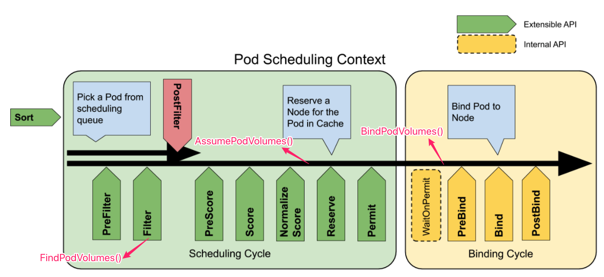

# Volume in Kube-Scheduler #

StorageClass 的 volumeBindingMode 字段可以用来控制什么时候执行 PV 和 PVC 的绑定操作和创建底层存储资源(仅限于支持动态创建底层存储资源的 Volume Plugin)，它有两个选项：

- **Immediate** 表示 PV 和 PVC 资源创建完成后立即绑定。由 Kube-Controller-Manager 中的 PersistentVolumeController 来完成绑定操作。
- **WaitForFirstConsumer** 表示 PV 和 PVC 资源创建完成后不会立即执行绑定操作，等使用 PVC 对象的 Pod 完成调度之后再进行 PV 和 PVC 的绑定。延迟绑定操作由 Kube-Scheduler 来完成。

接下来会详细分析第二种情况，即在 Pod 调度过程中 Volume 所有相关的操作。第一种情况可以参见 [PersistentVolume Controller](../../scratch/kube-controller-manager/volume/persistentvolume/overview.md)。

Volume 与调度器相关的代码并不在 `pkg/scheduler` 中，而在 `pkg/controller/volume/scheduling`，其中的对象会被调度器框架所引用。

其中的核心对象叫 SchedulerVolumeBinder。

```
type SchedulerVolumeBinder interface {
	FindPodVolumes(pod *v1.Pod, node *v1.Node) (reasons ConflictReasons, err error)
	AssumePodVolumes(assumedPod *v1.Pod, nodeName string) (allFullyBound bool, err error)
	BindPodVolumes(assumedPod *v1.Pod) error
	GetBindingsCache() PodBindingCache
	DeletePodBindings(pod *v1.Pod)
}
```

1. 在 Pod 调度过程中，首先会进入 **预选** 阶段，在这个阶段会筛选出哪些节点可以运行当前的 Pod。在这个阶段会调用 `FindPodVolumes()`，这个函数会检测当前 Pod 上所有的 PVC 对象能否在当前节点上，即 PVC 和对应的 PV 能否在当前节点上。例如有一些底层存储只能被一部分节点访问，那么在预选阶段，`FindPodVolumes()` 就不能匹配其它节点。这样便根据 Volume 对所有节点进行了过滤。
2. 在 **优选** 阶段没有与 Volume 相关的操作，代码中标记这部分为 TBD。
3. 优选阶段结束后，会执行 `AssumePodVolumes()`，作用是将 PVC 和 PV 进行预绑定，即在缓存中保存其绑定关系。
4. 在执行完调度之后，并且在执行 Pod 的绑定操作之前，会执行 PVC 和 PV 的绑定操作，即 `BindPodVolumes()`。

如果在调度节点执行完 PVC 和 PV 的预绑定操作 `AssumePodVolumes()` 之后，由于某些其它原因，导致 Pod 调度失败，这时会调用 `DeletePodBindings()` 将预绑定的操作进行回滚，即从缓存中删除绑定关系。

另外，SchedulerVolumeBinder 还有一个 `GetBindingsCache()`，这个函数在当前版本中没有使用。

下图是针对调度框架的各个细分过程中 Volume 相关几个函数的执行时机，下一节会从代码层面对其进行进一步详细的分析。



## 参考 ##

- https://kubernetes.io/docs/concepts/storage/storage-classes/#volume-binding-mode
